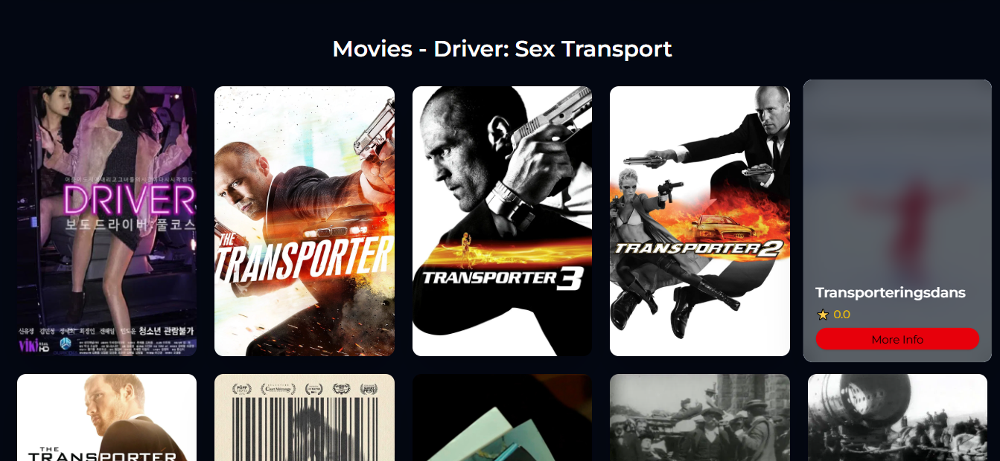
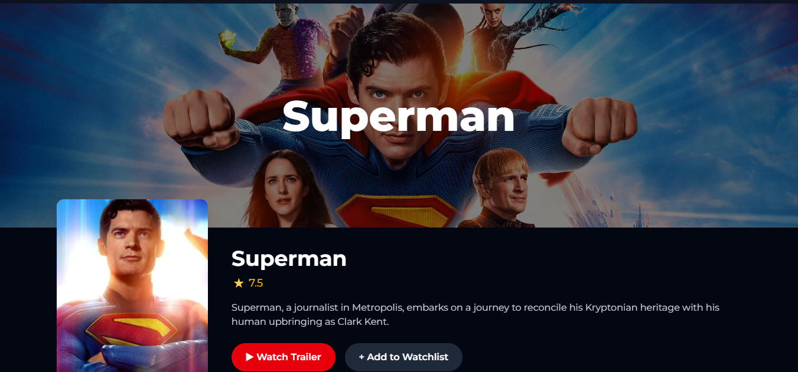
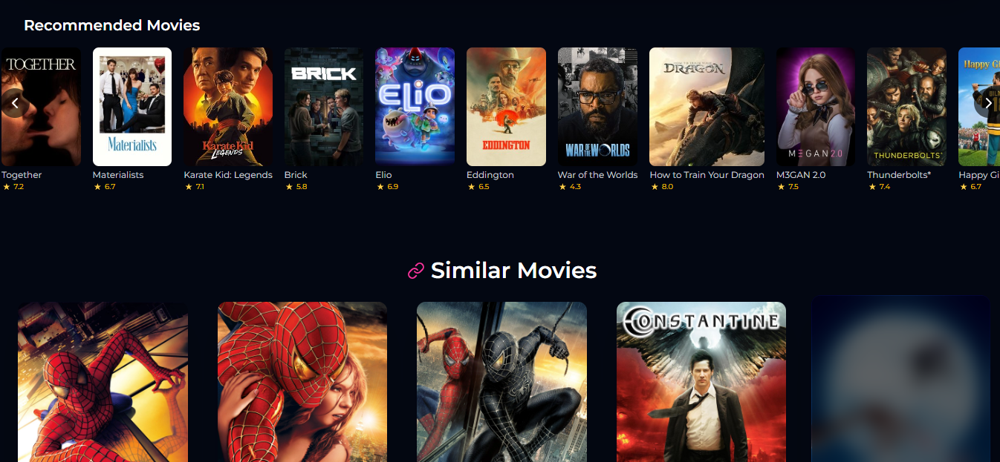

# CineSearch 🎬

CineSearch is a movie search web application built with **React**, **Tailwind CSS**, and **Firebase**.  
It allows users to search for movies, watch movie trailers, view details, and manage their account with authentication.

---

## 🚀 Features
- 🔍 Search for movies using a movie API  
- 📖 View detailed information about each movie  
- 👤 User authentication with Firebase (Signup, Login, Logout)  
- 🖼️ Upload and change profile photo  
- 🌙 Dark mode theme for a cinematic experience  

---

## 🛠️ Tech Stack
- **React** – Frontend library  
- **Tailwind CSS** – Styling  
- **Firebase** – Authentication & Storage  
- **Movie API** – Fetching movie data  

---

## 📸 Screenshots

### Homepage


### Movie Search Results


### Trending Movies


### Account Page


### Account Page






---

## ⚡ Installation & Setup

1. Clone the repository:
   ```bash
   git clone https://github.com/diddy0077/Cinesearch.git
   cd Cinesearch-app
   ```

2. Install dependencies:
   ```bash
   npm install
   ```

3. Add your **Firebase config** in `firebase.js`:
   ```javascript
   const firebaseConfig = {
     apiKey: "YOUR_API_KEY",
     authDomain: "YOUR_AUTH_DOMAIN",
     projectId: "YOUR_PROJECT_ID",
     storageBucket: "YOUR_STORAGE_BUCKET",
     messagingSenderId: "YOUR_MESSAGING_SENDER_ID",
     appId: "YOUR_APP_ID"
   };
   ```

4. Start the development server:
   ```bash
   npm start
   ```

---

## 🌍 Deployment

For deployment with GitHub Pages:
```bash
npm run deploy
```

Your app will be live at:
```
https://your-username.github.io/cinesearch-app/
```

---

## 📜 License
This project is open source and available under the [MIT License](LICENSE).
